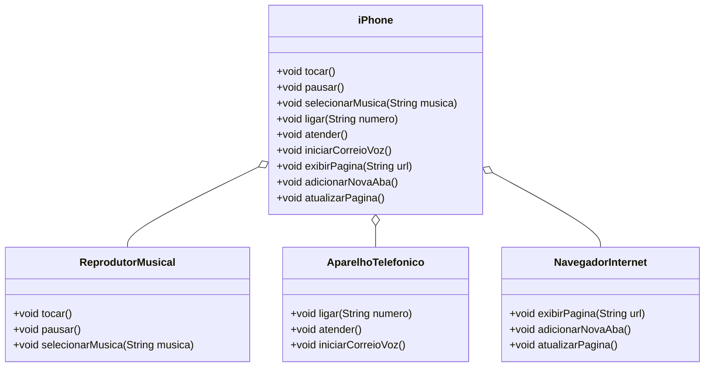

```mermaid
classDiagram
    class iPhone {
        +void tocar()
        +void pausar()
        +void selecionarMusica(String musica)
        +void ligar(String numero)
        +void atender()
        +void iniciarCorreioVoz()
        +void exibirPagina(String url)
        +void adicionarNovaAba()
        +void atualizarPagina()
    }

    class ReprodutorMusical {
        +void tocar()
        +void pausar()
        +void selecionarMusica(String musica)
    }

    class AparelhoTelefonico {
        +void ligar(String numero)
        +void atender()
        +void iniciarCorreioVoz()
    }

    class NavegadorInternet {
        +void exibirPagina(String url)
        +void adicionarNovaAba()
        +void atualizarPagina()
    }

    iPhone o-- ReprodutorMusical
    iPhone o-- AparelhoTelefonico
    iPhone o-- NavegadorInternet
```
